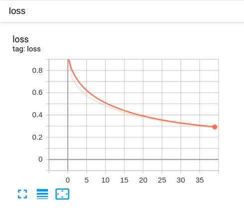

# Image-Caption
Try to realize image caption task with attention mechanism


## Download Dataset

### COCO 2017
```shell script
$ wget http://images.cocodataset.org/annotations/annotations_trainval2017.zip
$ wget http://images.cocodataset.org/zips/train2017.zip
$ wget http://images.cocodataset.org/zips/val2017.zip
```

## train logs

 |
|:-------------------------:|
Displayed one-state Loss on Tensorboard | 

```shell script
Epoch 1 Batch 0 Loss 2.0863
Epoch 1 Batch 100 Loss 1.0597
Epoch 1 Batch 200 Loss 0.8964
Epoch 1 Batch 300 Loss 0.8230
Epoch 1 Batch 400 Loss 0.7689
Epoch 1 Loss 0.930465
Time taken for 1 epoch 88.79079103469849 sec

Epoch 2 Batch 0 Loss 0.7520
Epoch 2 Batch 100 Loss 0.7526
Epoch 2 Batch 200 Loss 0.7243
Epoch 2 Batch 300 Loss 0.7454
Epoch 2 Batch 400 Loss 0.6925
Epoch 2 Loss 0.741867
Time taken for 1 epoch 62.70849061012268 sec

Epoch 3 Batch 0 Loss 0.7186
Epoch 3 Batch 100 Loss 0.6977
Epoch 3 Batch 200 Loss 0.6637
Epoch 3 Batch 300 Loss 0.7347
Epoch 3 Batch 400 Loss 0.6348
Epoch 3 Loss 0.679247
Time taken for 1 epoch 63.417168378829956 sec

Epoch 4 Batch 0 Loss 0.6524
Epoch 4 Batch 100 Loss 0.6305
Epoch 4 Batch 200 Loss 0.6449
Epoch 4 Batch 300 Loss 0.6961
Epoch 4 Batch 400 Loss 0.6886
Epoch 4 Loss 0.635317
Time taken for 1 epoch 62.047245502471924 sec

Epoch 5 Batch 0 Loss 0.6415
Epoch 5 Batch 100 Loss 0.5704
Epoch 5 Batch 200 Loss 0.5680
Epoch 5 Batch 300 Loss 0.5934
Epoch 5 Batch 400 Loss 0.6082
Epoch 5 Loss 0.602379
Time taken for 1 epoch 61.95527362823486 sec

Epoch 6 Batch 0 Loss 0.5951
Epoch 6 Batch 100 Loss 0.5788
Epoch 6 Batch 200 Loss 0.6203
Epoch 6 Batch 300 Loss 0.5834
Epoch 6 Batch 400 Loss 0.5760
Epoch 6 Loss 0.575292
Time taken for 1 epoch 62.17039442062378 sec

Epoch 7 Batch 0 Loss 0.5559
Epoch 7 Batch 100 Loss 0.5914
Epoch 7 Batch 200 Loss 0.5531
Epoch 7 Batch 300 Loss 0.6035
Epoch 7 Batch 400 Loss 0.5581
Epoch 7 Loss 0.551670
Time taken for 1 epoch 62.147112131118774 sec

Epoch 8 Batch 0 Loss 0.5465
Epoch 8 Batch 100 Loss 0.5727
Epoch 8 Batch 200 Loss 0.5478
Epoch 8 Batch 300 Loss 0.5074
Epoch 8 Batch 400 Loss 0.4858
Epoch 8 Loss 0.531773
Time taken for 1 epoch 62.23778820037842 sec

Epoch 9 Batch 0 Loss 0.5312
Epoch 9 Batch 100 Loss 0.5194
Epoch 9 Batch 200 Loss 0.5111
Epoch 9 Batch 300 Loss 0.5043
Epoch 9 Batch 400 Loss 0.4993
Epoch 9 Loss 0.514191
Time taken for 1 epoch 62.399840354919434 sec

Epoch 10 Batch 0 Loss 0.5738
Epoch 10 Batch 100 Loss 0.5311
Epoch 10 Batch 200 Loss 0.4454
Epoch 10 Batch 300 Loss 0.5031
Epoch 10 Batch 400 Loss 0.4839
Epoch 10 Loss 0.498033
Time taken for 1 epoch 62.07080340385437 sec

Epoch 11 Batch 0 Loss 0.4859
Epoch 11 Batch 100 Loss 0.4914
Epoch 11 Batch 200 Loss 0.4741
Epoch 11 Batch 300 Loss 0.5297
Epoch 11 Batch 400 Loss 0.4536
Epoch 11 Loss 0.482715
Time taken for 1 epoch 62.20662593841553 sec

Epoch 12 Batch 0 Loss 0.5237
Epoch 12 Batch 100 Loss 0.4764
Epoch 12 Batch 200 Loss 0.4750
Epoch 12 Batch 300 Loss 0.4888
Epoch 12 Batch 400 Loss 0.4580
Epoch 12 Loss 0.468855
Time taken for 1 epoch 62.08107018470764 sec

Epoch 13 Batch 0 Loss 0.4636
Epoch 13 Batch 100 Loss 0.4640
Epoch 13 Batch 200 Loss 0.4617
Epoch 13 Batch 300 Loss 0.4579
Epoch 13 Batch 400 Loss 0.4541
Epoch 13 Loss 0.456626
Time taken for 1 epoch 62.13136696815491 sec

Epoch 14 Batch 0 Loss 0.4467
Epoch 14 Batch 100 Loss 0.4213
Epoch 14 Batch 200 Loss 0.4393
Epoch 14 Batch 300 Loss 0.4257
Epoch 14 Batch 400 Loss 0.4088
Epoch 14 Loss 0.444544
Time taken for 1 epoch 62.1701021194458 sec

Epoch 15 Batch 0 Loss 0.4061
Epoch 15 Batch 100 Loss 0.4491
Epoch 15 Batch 200 Loss 0.4345
Epoch 15 Batch 300 Loss 0.4342
Epoch 15 Batch 400 Loss 0.4335
Epoch 15 Loss 0.432324
Time taken for 1 epoch 62.208892583847046 sec

Epoch 16 Batch 0 Loss 0.4426
Epoch 16 Batch 100 Loss 0.4414
Epoch 16 Batch 200 Loss 0.3999
Epoch 16 Batch 300 Loss 0.4284
Epoch 16 Batch 400 Loss 0.4027
Epoch 16 Loss 0.421366
Time taken for 1 epoch 62.30162858963013 sec

Epoch 17 Batch 0 Loss 0.3940
Epoch 17 Batch 100 Loss 0.4292
Epoch 17 Batch 200 Loss 0.3963
Epoch 17 Batch 300 Loss 0.3868
Epoch 17 Batch 400 Loss 0.3989
Epoch 17 Loss 0.412942
Time taken for 1 epoch 62.14147686958313 sec

Epoch 18 Batch 0 Loss 0.3981
Epoch 18 Batch 100 Loss 0.3659
Epoch 18 Batch 200 Loss 0.4522
Epoch 18 Batch 300 Loss 0.3812
Epoch 18 Batch 400 Loss 0.3981
Epoch 18 Loss 0.402603
Time taken for 1 epoch 62.11654210090637 sec

Epoch 19 Batch 0 Loss 0.3841
Epoch 19 Batch 100 Loss 0.3912
Epoch 19 Batch 200 Loss 0.4184
Epoch 19 Batch 300 Loss 0.3717
Epoch 19 Batch 400 Loss 0.3970
Epoch 19 Loss 0.392885
Time taken for 1 epoch 62.16392207145691 sec

Epoch 20 Batch 0 Loss 0.4362
Epoch 20 Batch 100 Loss 0.3851
Epoch 20 Batch 200 Loss 0.4008
Epoch 20 Batch 300 Loss 0.3794
Epoch 20 Batch 400 Loss 0.3680
Epoch 20 Loss 0.384853
Time taken for 1 epoch 62.12644672393799 sec

Epoch 21 Batch 0 Loss 0.3904
Epoch 21 Batch 100 Loss 0.3543
Epoch 21 Batch 200 Loss 0.3997
Epoch 21 Batch 300 Loss 0.3970
Epoch 21 Batch 400 Loss 0.3805
Epoch 21 Loss 0.382209
Time taken for 1 epoch 62.24511909484863 sec

Epoch 22 Batch 0 Loss 0.3926
Epoch 22 Batch 100 Loss 0.3838
Epoch 22 Batch 200 Loss 0.3491
Epoch 22 Batch 300 Loss 0.3854
Epoch 22 Batch 400 Loss 0.3587
Epoch 22 Loss 0.371357
Time taken for 1 epoch 62.219072103500366 sec

Epoch 23 Batch 0 Loss 0.3714
Epoch 23 Batch 100 Loss 0.3741
Epoch 23 Batch 200 Loss 0.3084
Epoch 23 Batch 300 Loss 0.3296
Epoch 23 Batch 400 Loss 0.3730
Epoch 23 Loss 0.363621
Time taken for 1 epoch 62.25777769088745 sec

Epoch 24 Batch 0 Loss 0.3738
Epoch 24 Batch 100 Loss 0.3567
Epoch 24 Batch 200 Loss 0.3628
Epoch 24 Batch 300 Loss 0.3637
Epoch 24 Batch 400 Loss 0.3498
Epoch 24 Loss 0.358977
Time taken for 1 epoch 62.57697415351868 sec

Epoch 25 Batch 0 Loss 0.3872
Epoch 25 Batch 100 Loss 0.4195
Epoch 25 Batch 200 Loss 0.3318
Epoch 25 Batch 300 Loss 0.3614
Epoch 25 Batch 400 Loss 0.3466
Epoch 25 Loss 0.352132
Time taken for 1 epoch 63.967907190322876 sec

Epoch 26 Batch 0 Loss 0.3206
Epoch 26 Batch 100 Loss 0.3347
Epoch 26 Batch 200 Loss 0.3387
Epoch 26 Batch 300 Loss 0.3584
Epoch 26 Batch 400 Loss 0.3120
Epoch 26 Loss 0.344149
Time taken for 1 epoch 63.447741985321045 sec

Epoch 27 Batch 0 Loss 0.3415
Epoch 27 Batch 100 Loss 0.3525
Epoch 27 Batch 200 Loss 0.3529
Epoch 27 Batch 300 Loss 0.3527
Epoch 27 Batch 400 Loss 0.3293
Epoch 27 Loss 0.340496
Time taken for 1 epoch 63.6301372051239 sec

Epoch 28 Batch 0 Loss 0.3349
Epoch 28 Batch 100 Loss 0.2965
Epoch 28 Batch 200 Loss 0.3220
Epoch 28 Batch 300 Loss 0.2956
Epoch 28 Batch 400 Loss 0.3189
Epoch 28 Loss 0.334551
Time taken for 1 epoch 63.77362656593323 sec

Epoch 29 Batch 0 Loss 0.3655
Epoch 29 Batch 100 Loss 0.3289
Epoch 29 Batch 200 Loss 0.3342
Epoch 29 Batch 300 Loss 0.3206
Epoch 29 Batch 400 Loss 0.3251
Epoch 29 Loss 0.329783
Time taken for 1 epoch 62.467034101486206 sec

Epoch 30 Batch 0 Loss 0.3274
Epoch 30 Batch 100 Loss 0.3244
Epoch 30 Batch 200 Loss 0.3332
Epoch 30 Batch 300 Loss 0.3009
Epoch 30 Batch 400 Loss 0.3038
Epoch 30 Loss 0.324632
Time taken for 1 epoch 62.47533202171326 sec

Epoch 31 Batch 0 Loss 0.3113
Epoch 31 Batch 100 Loss 0.3477
Epoch 31 Batch 200 Loss 0.3191
Epoch 31 Batch 300 Loss 0.3609
Epoch 31 Batch 400 Loss 0.3035
Epoch 31 Loss 0.321229
Time taken for 1 epoch 62.55126929283142 sec

Epoch 32 Batch 0 Loss 0.2778
Epoch 32 Batch 100 Loss 0.3289
Epoch 32 Batch 200 Loss 0.3057
Epoch 32 Batch 300 Loss 0.3099
Epoch 32 Batch 400 Loss 0.2980
Epoch 32 Loss 0.316528
Time taken for 1 epoch 62.464524030685425 sec

Epoch 33 Batch 0 Loss 0.3295
Epoch 33 Batch 100 Loss 0.2889
Epoch 33 Batch 200 Loss 0.3131
Epoch 33 Batch 300 Loss 0.3423
Epoch 33 Batch 400 Loss 0.3448
Epoch 33 Loss 0.312820
Time taken for 1 epoch 62.75636649131775 sec

Epoch 34 Batch 0 Loss 0.3229
Epoch 34 Batch 100 Loss 0.3235
Epoch 34 Batch 200 Loss 0.3091
Epoch 34 Batch 300 Loss 0.3469
Epoch 34 Batch 400 Loss 0.3308
Epoch 34 Loss 0.307286
Time taken for 1 epoch 62.305132150650024 sec

Epoch 35 Batch 0 Loss 0.3148
Epoch 35 Batch 100 Loss 0.2995
Epoch 35 Batch 200 Loss 0.3408
Epoch 35 Batch 300 Loss 0.3138
Epoch 35 Batch 400 Loss 0.3434
Epoch 35 Loss 0.304650
Time taken for 1 epoch 62.25085163116455 sec

Epoch 36 Batch 0 Loss 0.3383
Epoch 36 Batch 100 Loss 0.3102
Epoch 36 Batch 200 Loss 0.2898
Epoch 36 Batch 300 Loss 0.3076
Epoch 36 Batch 400 Loss 0.3222
Epoch 36 Loss 0.301535
Time taken for 1 epoch 62.374159812927246 sec

Epoch 37 Batch 0 Loss 0.2838
Epoch 37 Batch 100 Loss 0.2927
Epoch 37 Batch 200 Loss 0.3351
Epoch 37 Batch 300 Loss 0.2726
Epoch 37 Batch 400 Loss 0.3107
Epoch 37 Loss 0.297765
Time taken for 1 epoch 62.236708641052246 sec

Epoch 38 Batch 0 Loss 0.2836
Epoch 38 Batch 100 Loss 0.2958
Epoch 38 Batch 200 Loss 0.3041
Epoch 38 Batch 300 Loss 0.2941
Epoch 38 Batch 400 Loss 0.3319
Epoch 38 Loss 0.292036
Time taken for 1 epoch 62.27911949157715 sec

Epoch 39 Batch 0 Loss 0.2858
Epoch 39 Batch 100 Loss 0.2938
Epoch 39 Batch 200 Loss 0.2788
Epoch 39 Batch 300 Loss 0.2647
Epoch 39 Batch 400 Loss 0.2693
Epoch 39 Loss 0.291534
Time taken for 1 epoch 62.24754738807678 sec

Epoch 40 Batch 0 Loss 0.3388
Epoch 40 Batch 100 Loss 0.3091
Epoch 40 Batch 200 Loss 0.2944
Epoch 40 Batch 300 Loss 0.2755
Epoch 40 Batch 400 Loss 0.2842
Epoch 40 Loss 0.287238
Time taken for 1 epoch 62.27051019668579 sec
```

## TODO

## Reference


